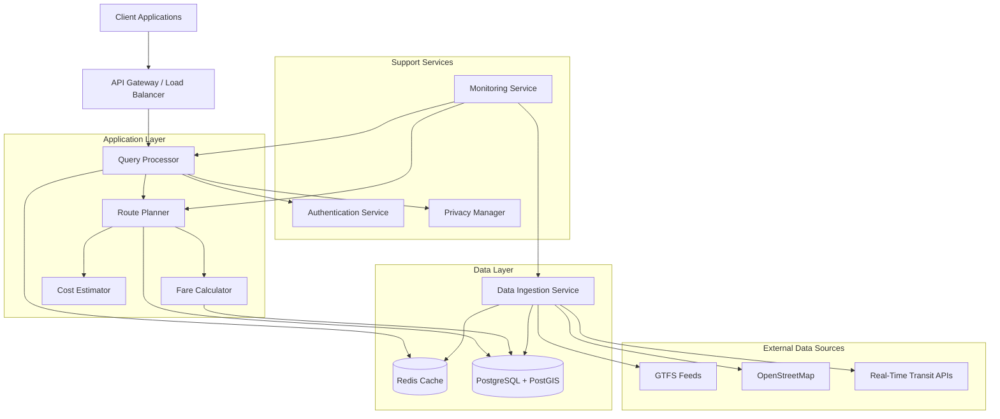

# Design Document: Multimodal Transportation Routing Platform

## Overview

The Multimodal Transportation Routing Platform is a cloud-native system that provides intelligent route planning across multiple modes of transportation. The system uses graph-based routing algorithms, real-time data integration, and distributed caching to deliver fast, accurate, and cost-effective travel recommendations.

### Key Design Principles

1. **Separation of Concerns**: Clear boundaries between data ingestion, routing computation, API layer, and caching
2. **Scalability**: Stateless services enabling horizontal scaling
3. **Performance**: Multi-level caching and parallel processing 
4. **Data Freshness**: Continuous ingestion of real-time transit updates and periodic batch updates
5. **Privacy by Design**: Data anonymization and encryption at all layers
6. **Extensibility**: Modular architecture supporting new transport modes and cities

### Technology Stack

- **Backend**: Python 3.10+ with FastAPI for async API handling
- **Database**: PostgreSQL 14+ with PostGIS extension for geospatial queries
- **Cache**: Redis 7+ for route caching and session management
- **Message Queue**: Redis Streams for data ingestion pipeline
- **Routing Engine**: Custom implementation using Dijkstra's algorithm with transfer penalties
- **Geospatial**: GeoPandas, Shapely, and pyproj for coordinate transformations
- **Data Processing**: Pandas for GTFS processing, OSMnx for OpenStreetMap data
- **Monitoring**: Prometheus for metrics, Grafana for visualization
- **Deployment**: Docker containers orchestrated with Kubernetes

## Architecture

### System Architecture



### Data Flow

1. **Route Query Flow**:
   - Client sends route request (origin, destination, time, preferences) to API Gateway
   - Query Processor validates request and checks Authentication Service
   - Query Processor checks Redis Cache for recent identical queries
   - If cache miss, Query Processor invokes Route Planner
   - Route Planner loads relevant graph data from PostgreSQL
   - Route Planner computes multimodal routes using modified Dijkstra's algorithm
   - Fare Calculator estimates costs for each route segment
   - Cost Estimator aggregates total costs and emissions
   - Results cached in Redis with 5-minute TTL
   - Response returned to client with route details, costs, and timing

2. **Data Ingestion Flow**:
   - Data Ingestion Service polls external sources on schedule
   - GTFS feeds downloaded and validated against specification
   - OSM data extracted for relevant geographic regions
   - Real-time updates polled every 30 seconds
   - Data transformed and loaded into PostgreSQL
   - Cache invalidated for affected routes
   - Monitoring Service notified of ingestion completion

### Routing Algorithm

The core routing algorithm is a modified Dijkstra's algorithm that operates on a multimodal transportation graph:

**Graph Structure**:
- **Nodes**: Transit stops, street intersections, points of interest
- **Edges**: Walking paths, transit connections, bike routes, road segments
- **Edge Weights**: Combination of time, cost, and preference factors

**Multimodal Considerations**:
- **Transfer Penalties**: Additional time cost  when switching modes
- **Mode Preferences**: User-specified weights for different transport modes
- **Time Windows**: Transit edges only valid during scheduled service times
- **Capacity Constraints**: Real-time crowding information affects route scoring

**Algorithm Pseudocode**:
```
function computeMultimodalRoute(origin, destination, departureTime, preferences):
    graph = loadRelevantGraph(origin, destination)
    
    priorityQueue = MinHeap()
    priorityQueue.insert((0, origin, null, departureTime))
    
    visited = Set()
    bestPaths = Map()
    
    while not priorityQueue.isEmpty():
        (cost, currentNode, previousMode, currentTime) = priorityQueue.extractMin()
        
        if currentNode == destination:
            return reconstructPath(bestPaths, destination)
        
        if currentNode in visited:
            continue
        
        visited.add(currentNode)
        
        for edge in graph.getOutgoingEdges(currentNode):
            if not edge.isValidAt(currentTime):
                continue
            
            nextNode = edge.destination
            travelTime = edge.getTravelTime(currentTime)
            travelCost = edge.getCost()
            mode = edge.transportMode
            
            transferPenalty = 0
            if previousMode != null and previousMode != mode:
                transferPenalty = getTransferPenalty(previousMode, mode)
            
            edgeCost = computeEdgeCost(travelTime, travelCost, transferPenalty, preferences)
            totalCost = cost + edgeCost
            arrivalTime = currentTime + travelTime + transferPenalty
            
            if nextNode not in bestPaths or totalCost < bestPaths[nextNode].cost:
                bestPaths[nextNode] = (totalCost, currentNode, edge, arrivalTime)
                priorityQueue.insert((totalCost, nextNode, mode, arrivalTime))
    
    return null  // No path found

function computeEdgeCost(time, cost, penalty, preferences):
    timeFactor = preferences.timeWeight
    costFactor = preferences.costWeight
    ecoFactor = preferences.ecoWeight
    
    emissions = estimateEmissions(mode, distance)
    
    return (time + penalty) * timeFactor + cost * costFactor + emissions * ecoFactor
```

## Components and Interfaces

### Query Processor

**Responsibilities**:
- Validate incoming route requests
- Authenticate and authorize users
- Check cache for existing results
- Coordinate with Route Planner for new computations
- Apply rate limiting
- Return formatted responses

**Interface**:
```python
class QueryProcessor:
    def process_route_query(
        self,
        origin: Coordinate,
        destination: Coordinate,
        departure_time: datetime,
        preferences: UserPreferences,
        auth_token: str
    ) -> RouteResponse:
        """
        Process a route query and return optimal routes.
        
        Args:
            origin: Starting location (lat, lon)
            destination: Ending location (lat, lon)
            departure_time: When the journey should start
            preferences: User preferences (fastest, cheapest, eco-friendly)
            auth_token: Authentication token
            
        Returns:
            RouteResponse containing one or more route options
            
        Raises:
            AuthenticationError: If token is invalid
            ValidationError: If inputs are malformed
            RateLimitError: If rate limit exceeded
        """
        pass
    
    def check_cache(self, query_hash: str) -> Optional[RouteResponse]:
        """Check if query result exists in cache."""
        pass
    
    def store_cache(self, query_hash: str, response: RouteResponse, ttl: int):
        """Store query result in cache with TTL."""
        pass
```

### Route Planner

**Responsibilities**:
- Load relevant graph data for query region
- Execute multimodal routing algorithm
- Handle real-time transit updates
- Compute alternative routes
- Coordinate with Fare Calculator and Cost Estimator

**Interface**:
```python
class RoutePlanner:
    def compute_routes(
        self,
        origin: Coordinate,
        destination: Coordinate,
        departure_time: datetime,
        preferences: UserPreferences,
        num_alternatives: int = 3
    ) -> List[Route]:
        """
        Compute multimodal routes between origin and destination.
        
        Args:
            origin: Starting location
            destination: Ending location
            departure_time: Journey start time
            preferences: Optimization criteria
            num_alternatives: Number of alternative routes to return
            
        Returns:
            List of Route objects sorted by preference score
        """
        pass
    
    def load_graph(self, bbox: BoundingBox) -> TransportGraph:
        """Load transportation graph for geographic region."""
        pass
    
    def apply_realtime_updates(self, graph: TransportGraph) -> TransportGraph:
        """Apply real-time delays and disruptions to graph."""
        pass
```

### Fare Calculator

**Responsibilities**:
- Estimate costs for each transport mode
- Apply tariff rules and fare structures
- Identify multi-ride discounts (day passes, etc.)
- Handle missing fare data gracefully

**Interface**:
```python
class FareCalculator:
    def calculate_fare(
        self,
        segment: JourneySegment,
        context: FareContext
    ) -> FareEstimate:
        """
        Calculate fare for a journey segment.
        
        Args:
            segment: Journey segment with mode and route details
            context: Context including previous segments for transfer discounts
            
        Returns:
            FareEstimate with cost and confidence level
        """
        pass
    
    def get_tariff_rules(self, mode: TransportMode, region: str) -> TariffRules:
        """Retrieve tariff rules for transport mode in region."""
        pass
    
    def recommend_pass(self, segments: List[JourneySegment]) -> Optional[PassRecommendation]:
        """Recommend day pass or multi-ride ticket if economical."""
        pass
```

### Data Ingestion Service

**Responsibilities**:
- Download and validate GTFS feeds
- Extract and process OpenStreetMap data
- Poll real-time transit APIs
- Transform data for database storage
- Invalidate affected cache entries

**Interface**:
```python
class DataIngestionService:
    def ingest_gtfs_feed(self, feed_url: str, agency_id: str) -> IngestionResult:
        """
        Download and process GTFS feed.
        
        Args:
            feed_url: URL to GTFS zip file
            agency_id: Identifier for transit agency
            
        Returns:
            IngestionResult with status and statistics
        """
        pass
    
    def ingest_osm_data(self, bbox: BoundingBox, city_id: str) -> IngestionResult:
        """Extract and process OpenStreetMap data for region."""
        pass
    
    def poll_realtime_updates(self, agency_id: str) -> List[TransitUpdate]:
        """Poll real-time transit API for updates."""
        pass
    
    def validate_gtfs(self, feed_path: str) -> ValidationReport:
        """Validate GTFS feed against specification."""
        pass
```

### Authentication Service

**Responsibilities**:
- Validate user credentials
- Issue and verify JWT tokens
- Enforce rate limiting per user/API key
- Implement account lockout after failed attempts

**Interface**:
```python
class AuthenticationService:
    def authenticate(self, credentials: Credentials) -> AuthToken:
        """
        Authenticate user and issue token.
        
        Args:
            credentials: Username/password or API key
            
        Returns:
            JWT token with 24-hour expiration
            
        Raises:
            AuthenticationError: If credentials invalid
            AccountLockedError: If account temporarily locked
        """
        pass
    
    def verify_token(self, token: str) -> TokenPayload:
        """Verify JWT token and extract payload."""
        pass
    
    def check_rate_limit(self, user_id: str) -> bool:
        """Check if user has exceeded rate limit."""
        pass
```


## Data Models

### Core Data Structures

**Coordinate**:
```python
@dataclass
class Coordinate:
    latitude: float  # WGS84 latitude in degrees
    longitude: float  # WGS84 longitude in degrees
    
    def to_point(self) -> Point:
        """Convert to PostGIS Point geometry."""
        return Point(self.longitude, self.latitude)
    
    def distance_to(self, other: Coordinate) -> float:
        """Calculate geodesic distance in meters."""
        pass
```

**Route**:
```python
@dataclass
class Route:
    segments: List[JourneySegment]
    total_duration: timedelta
    total_cost: FareEstimate
    total_emissions: float  # kg CO2
    departure_time: datetime
    arrival_time: datetime
    confidence_score: float  # 0.0 to 1.0
    
    def to_geojson(self) -> dict:
        """Export route as GeoJSON for visualization."""
        pass
```

**JourneySegment**:
```python
@dataclass
class JourneySegment:
    mode: TransportMode
    origin: Coordinate
    destination: Coordinate
    departure_time: datetime
    arrival_time: datetime
    distance: float  # meters
    path: LineString  # Geographic path
    instructions: List[str]  # Turn-by-turn or transit instructions
    
    # Mode-specific details
    transit_details: Optional[TransitDetails] = None
    walking_details: Optional[WalkingDetails] = None
```

**TransportMode**:
```python
class TransportMode(Enum):
    WALK = "walk"
    BIKE = "bike"
    BUS = "bus"
    TRAIN = "train"
    SUBWAY = "subway"
    TRAM = "tram"
    FERRY = "ferry"
    RIDESHARE = "rideshare"
```

**UserPreferences**:
```python
@dataclass
class UserPreferences:
    optimization: OptimizationCriterion  # FASTEST, CHEAPEST, ECO_FRIENDLY
    max_walking_distance: float  # meters
    max_transfers: int
    accessible_only: bool
    preferred_modes: Set[TransportMode]
    avoid_modes: Set[TransportMode]
    
    # Weighting factors (sum to 1.0)
    time_weight: float = 0.5
    cost_weight: float = 0.3
    eco_weight: float = 0.2
```

### Database Schema

**PostgreSQL Tables**:

```sql
-- Transit stops from GTFS
CREATE TABLE transit_stops (
    stop_id VARCHAR(255) PRIMARY KEY,
    agency_id VARCHAR(255) NOT NULL,
    stop_name VARCHAR(255) NOT NULL,
    location GEOGRAPHY(POINT, 4326) NOT NULL,
    wheelchair_accessible BOOLEAN DEFAULT FALSE,
    created_at TIMESTAMP DEFAULT NOW()
);

CREATE INDEX idx_stops_location ON transit_stops USING GIST(location);

-- Transit routes
CREATE TABLE transit_routes (
    route_id VARCHAR(255) PRIMARY KEY,
    agency_id VARCHAR(255) NOT NULL,
    route_short_name VARCHAR(50),
    route_long_name VARCHAR(255),
    route_type INTEGER NOT NULL,  -- GTFS route type
    route_color VARCHAR(6)
);

-- Transit trips and schedules
CREATE TABLE transit_trips (
    trip_id VARCHAR(255) PRIMARY KEY,
    route_id VARCHAR(255) REFERENCES transit_routes(route_id),
    service_id VARCHAR(255) NOT NULL,
    trip_headsign VARCHAR(255),
    direction_id INTEGER
);

CREATE TABLE stop_times (
    trip_id VARCHAR(255) REFERENCES transit_trips(trip_id),
    stop_id VARCHAR(255) REFERENCES transit_stops(stop_id),
    arrival_time INTERVAL NOT NULL,
    departure_time INTERVAL NOT NULL,
    stop_sequence INTEGER NOT NULL,
    PRIMARY KEY (trip_id, stop_sequence)
);

CREATE INDEX idx_stop_times_stop ON stop_times(stop_id);

-- Street network from OSM
CREATE TABLE street_nodes (
    node_id BIGINT PRIMARY KEY,
    location GEOGRAPHY(POINT, 4326) NOT NULL
);

CREATE TABLE street_edges (
    edge_id SERIAL PRIMARY KEY,
    source_node BIGINT REFERENCES street_nodes(node_id),
    target_node BIGINT REFERENCES street_nodes(node_id),
    geometry GEOGRAPHY(LINESTRING, 4326) NOT NULL,
    length FLOAT NOT NULL,  -- meters
    highway_type VARCHAR(50),  -- OSM highway tag
    walkable BOOLEAN DEFAULT TRUE,
    bikeable BOOLEAN DEFAULT FALSE,
    max_speed INTEGER  -- km/h
);

CREATE INDEX idx_edges_source ON street_edges(source_node);
CREATE INDEX idx_edges_target ON street_edges(target_node);
CREATE INDEX idx_edges_geometry ON street_edges USING GIST(geometry);

-- Fare rules
CREATE TABLE fare_rules (
    rule_id SERIAL PRIMARY KEY,
    agency_id VARCHAR(255) NOT NULL,
    route_id VARCHAR(255),
    origin_zone VARCHAR(50),
    destination_zone VARCHAR(50),
    fare_amount DECIMAL(10, 2) NOT NULL,
    currency VARCHAR(3) DEFAULT 'USD',
    valid_from DATE,
    valid_until DATE
);

-- Real-time updates
CREATE TABLE realtime_updates (
    update_id SERIAL PRIMARY KEY,
    trip_id VARCHAR(255),
    stop_id VARCHAR(255),
    delay_seconds INTEGER,  -- Positive for delays, negative for early
    update_type VARCHAR(20),  -- DELAY, CANCELLATION, DETOUR
    timestamp TIMESTAMP DEFAULT NOW(),
    expires_at TIMESTAMP
);

CREATE INDEX idx_realtime_trip ON realtime_updates(trip_id);
CREATE INDEX idx_realtime_expires ON realtime_updates(expires_at);

-- User data (anonymized)
CREATE TABLE user_queries (
    query_id UUID PRIMARY KEY DEFAULT gen_random_uuid(),
    user_id VARCHAR(255),  -- Hashed user identifier
    origin_zone VARCHAR(50),  -- Anonymized to zone level
    destination_zone VARCHAR(50),
    query_time TIMESTAMP DEFAULT NOW(),
    preferences JSONB
);

CREATE INDEX idx_queries_time ON user_queries(query_time);
```

### Redis Cache Structure

**Cache Keys**:
- `route:{hash}` - Cached route results (TTL: 5 minutes)
- `graph:{city_id}:{bbox}` - Cached graph data (TTL: 1 hour)
- `realtime:{agency_id}` - Real-time updates (TTL: 30 seconds)
- `ratelimit:{user_id}` - Rate limiting counters (TTL: 1 minute)
- `session:{token}` - User session data (TTL: 24 hours)

**Cache Invalidation Strategy**:
- Time-based expiration for most entries
- Explicit invalidation when new GTFS data ingested
- LRU eviction when memory threshold exceeded


## Correctness Properties

A property is a characteristic or behavior that should hold true across all valid executions of a system—essentially, a formal statement about what the system should do. Properties serve as the bridge between human-readable specifications and machine-verifiable correctness guarantees.

### Property 1: Valid Route Structure

*For any* valid origin, destination, and departure time, the Route_Planner should return at least one route where:
- All segments are connected (each segment's destination matches the next segment's origin)
- Segment times are sequential (no time travel)
- Transfer times between different modes are at least 3 minutes
- The route respects real-time transit schedules from GTFS data

**Validates: Requirements 1.1, 1.3, 1.4**

### Property 2: Mode Diversity in Routing

*For any* origin and destination where multiple transport modes are available in the graph, the Route_Planner should evaluate and consider combinations of different modes (not just single-mode routes).

**Validates: Requirements 1.2**

### Property 3: Preference Optimization (Metamorphic)

*For any* origin and destination, when comparing routes optimized for different preferences:
- Routes optimized for "cheapest" should have lower or equal total cost than "fastest" routes
- Routes optimized for "fastest" should have lower or equal duration than "cheapest" routes
- Routes optimized for "eco-friendly" should have lower or equal emissions than other preferences

**Validates: Requirements 1.5**

### Property 4: Cost Calculation Invariant

*For any* computed route, the total cost should equal the sum of all segment costs, and each segment cost should be calculated according to the applicable tariff rules for that transport mode and region.

**Validates: Requirements 2.1, 2.2**

### Property 5: Missing Fare Data Handling

*For any* journey segment where fare data is unavailable, the Fare_Calculator should mark the cost as unknown (not zero or null), and this should be reflected in the route's confidence score.

**Validates: Requirements 2.3**

### Property 6: Fare Optimization

*For any* set of journey segments, if a day pass or multi-ride ticket is more economical than individual fares, the Fare_Calculator should recommend the pass option.

**Validates: Requirements 2.4**

### Property 7: Data Validation Before Ingestion

*For any* GTFS feed or OSM dataset, the Data_Ingestion_Service should validate data integrity (schema compliance, referential integrity) and reject invalid data before database insertion.

### Property 8: Geodesic Distance Calculation

*For any* two coordinates, the distance calculation should use geodesic formulas (accounting for Earth's curvature) rather than Euclidean distance, with results matching established geospatial libraries within 0.1% tolerance.

**Validates: Requirements 7.1**

### Property 9: OSM Network Extraction

*For any* OSM dataset with tagged ways (highway=footway, highway=cycleway, etc.), the Route_Planner should correctly extract and categorize walkable paths, bike lanes, and road networks according to OSM tag semantics.

**Validates: Requirements 7.2**

### Property 10: Accessibility Route Filtering

*For any* route request with accessibility mode enabled, all returned routes should only include wheelchair-accessible segments (no stairs, steep inclines, or inaccessible transit stops).

**Validates: Requirements 7.3, 14.1, 14.2**

### Property 11: Coordinate System Round Trip

*For any* coordinate in WGS84, transforming to a local projection and back to WGS84 should produce a coordinate within 1 meter of the original (round-trip property).

**Validates: Requirements 7.4**

### Property 12: Network Path Following

*For any* walking or cycling segment in a route, the path should follow edges in the street network graph rather than being a straight line between origin and destination.

**Validates: Requirements 7.5**

### Property 13: Real-Time Delay Integration

*For any* route that includes a transit trip with real-time delay information, the route's timing should reflect the delay (arrival/departure times adjusted accordingly).

**Validates: Requirements 8.1**

### Property 14: Alternative Routes on Disruption

*For any* route affected by a cancellation or major disruption, the Route_Planner should provide at least one alternative route that avoids the disrupted service.

**Validates: Requirements 8.2**

### Property 15: Scheduled Data Fallback

*For any* route computation when real-time data is unavailable, the Route_Planner should use scheduled GTFS data and indicate reduced confidence in the route's timing accuracy.

**Validates: Requirements 8.4**

### Property 16: Reliability-Based Prioritization

*For any* two routes with similar cost and duration, the route with higher historical reliability score should be ranked higher in the results.

**Validates: Requirements 8.5**

### Property 17: Stateless Operation

*For any* two identical route queries sent to different Route_Planner instances, the results should be identical (same routes, costs, timings), demonstrating stateless operation.

**Validates: Requirements 9.3**

### Property 18: Ingestion Operation Logging

*For any* data ingestion operation (GTFS, OSM, real-time), a log entry should be created with timestamp, operation type, status code, and any error messages.

**Validates: Requirements 10.3**

### Property 19: Error Diagnostic Capture

*For any* exception or error in system components, diagnostic information including stack traces, context, and relevant state should be captured and made available for debugging.

**Validates: Requirements 10.5**

### Property 20: Multi-City Data Isolation

*For any* route query in city A, the results should only use geographic and transit data from city A's dataset, with no contamination from other cities' data.

**Validates: Requirements 11.1, 11.2, 11.3**

### Property 21: City Boundary Identification

*For any* coordinate in a region where multiple cities have overlapping boundaries, the Route_Planner should correctly identify and use the appropriate city's dataset based on administrative boundaries.

**Validates: Requirements 11.4**

### Property 22: JSON API Format

*For any* API request and response, the data should be valid JSON, parseable without errors, and conforming to the API schema.

**Validates: Requirements 13.4, 13.5**

### Property 23: Accessibility Feature Indication

*For any* transit station with elevator, ramp, or other accessibility feature data, this information should be included in route segments that use that station.

**Validates: Requirements 14.3**

### Property 24: Accessibility Uncertainty Indication

*For any* route where accessibility data is incomplete or missing for one or more segments, the route should clearly indicate this uncertainty (e.g., confidence flag or warning).

**Validates: Requirements 14.4**

### Property 25: Mobility Aid Filtering

*For any* route query specifying a mobility aid (wheelchair, walker, etc.), the returned routes should be filtered to only include segments compatible with that mobility aid.

**Validates: Requirements 14.5**

### Property 26: Backup Integrity Verification

*For any* backup created by the system, a checksum should be computed and stored, and the backup should be verifiable against this checksum to ensure integrity.

**Validates: Requirements 15.3**

### Property 27: OSM Attribution Presence

*For any* route response that uses OpenStreetMap data, the response should include proper OSM attribution text as required by the ODbL license.

**Validates: Requirements 16.1**

### Property 28: Data Source License Tracking

*For any* data source (GTFS feed, OSM extract, etc.) ingested into the system, license information and attribution requirements should be stored and retrievable.

**Validates: Requirements 16.2**

## Error Handling

### Error Categories

1. **Input Validation Errors**:
   - Invalid coordinates (out of bounds, NaN values)
   - Invalid timestamps (past dates, malformed formats)
   - Missing required fields
   - Response: HTTP 400 with descriptive error message

2. **Authentication/Authorization Errors**:
   - Invalid or expired tokens
   - Insufficient permissions
   - Rate limit exceeded
   - Response: HTTP 401/403 with error details

3. **Data Availability Errors**:
   - No route found between origin and destination
   - Requested city not supported
   - Transit data unavailable for requested time
   - Response: HTTP 404 with explanation and suggestions

4. **External Service Errors**:
   - GTFS feed download failure
   - Real-time API unavailable
   - Database connection failure
   - Response: Retry with exponential backoff, fallback to cached/scheduled data

5. **System Errors**:
   - Out of memory
   - Timeout during route computation
   - Database query failure
   - Response: HTTP 500, log error with diagnostics, alert monitoring

### Error Handling Strategies

**Graceful Degradation**:
- If real-time data unavailable, fall back to scheduled data
- If fare data missing, indicate unknown cost rather than failing
- If accessibility data incomplete, indicate uncertainty

**Retry Logic**:
- Data ingestion failures: 3 retries with exponential backoff (1s, 2s, 4s)
- External API calls: 2 retries with 500ms delay
- Database transient errors: 3 retries with 100ms delay


**Timeout Configuration**:
- Route computation: 5 seconds maximum
- Database queries: 2 seconds maximum
- External API calls: 10 seconds maximum
- Cache operations: 100ms maximum

## Testing Strategy

### Dual Testing Approach

The system requires both unit testing and property-based testing for comprehensive coverage:

**Unit Tests** focus on:
- Specific examples demonstrating correct behavior
- Edge cases (empty inputs, boundary values, special characters)
- Error conditions and exception handling
- Integration points between components
- Specific scenarios like account lockout after 5 failed attempts (Requirement 5.3)
- Cache behavior with 5-minute TTL (Requirement 4.2)
- Rate limiting at 100 requests/minute (Requirement 12.4)

**Property-Based Tests** focus on:
- Universal properties that hold for all inputs
- Invariants that must be maintained (route structure, cost calculations)
- Round-trip properties (coordinate transformations, serialization)
- Metamorphic properties (preference optimization)
- Comprehensive input coverage through randomization

### Property-Based Testing Configuration

**Framework**: Use Hypothesis (Python) for property-based testing

**Test Configuration**:
- Minimum 100 iterations per property test (due to randomization)
- Each test tagged with: **Feature: multimodal-transport-routing, Property {N}: {property_text}**
- Seed-based reproducibility for failed test cases
- Shrinking enabled to find minimal failing examples

**Example Property Test Structure**:
```python
from hypothesis import given, strategies as st
import pytest

@given(
    origin=st.tuples(st.floats(-90, 90), st.floats(-180, 180)),
    destination=st.tuples(st.floats(-90, 90), st.floats(-180, 180)),
    departure_time=st.datetimes(min_value=datetime.now())
)
@pytest.mark.property_test
@pytest.mark.tag("Feature: multimodal-transport-routing, Property 1: Valid Route Structure")
def test_route_structure_invariants(origin, destination, departure_time):
    """
    Property 1: For any valid origin, destination, and departure time,
    returned routes should have valid structure with connected segments
    and sequential timing.
    """
    route_planner = RoutePlanner()
    routes = route_planner.compute_routes(origin, destination, departure_time)
    
    assert len(routes) >= 1, "At least one route should be returned"
    
    for route in routes:
        # Check segments are connected
        for i in range(len(route.segments) - 1):
            assert route.segments[i].destination == route.segments[i+1].origin
        
        # Check timing is sequential
        for i in range(len(route.segments) - 1):
            assert route.segments[i].arrival_time <= route.segments[i+1].departure_time
        
        # Check transfer times
        for i in range(len(route.segments) - 1):
            if route.segments[i].mode != route.segments[i+1].mode:
                transfer_time = (route.segments[i+1].departure_time - 
                               route.segments[i].arrival_time).total_seconds()
                assert transfer_time >= 180, "Transfer time should be at least 3 minutes"
```

**Generator Strategies**:
- Coordinates: Valid lat/lon within supported regions
- Timestamps: Future datetimes within reasonable range (next 7 days)
- Preferences: All valid combinations of optimization criteria
- Transport modes: All supported mode combinations
- GTFS data: Valid feed structures with realistic schedules
- OSM data: Valid way/node structures with proper tags

**Edge Cases to Cover**:
- Empty results (no route possible)
- Single-segment routes (direct walking)
- Maximum transfers (complex multi-modal routes)
- Boundary coordinates (city edges, international date line)
- Midnight crossings (routes spanning multiple days)
- Real-time delays causing missed connections

### Integration Testing

**Test Scenarios**:
1. End-to-end route query with database and cache
2. Data ingestion pipeline from GTFS download to database storage
3. Real-time update integration affecting active routes
4. Multi-city routing with proper data isolation
5. Authentication flow with token generation and validation

### Performance Testing

**Benchmarks**:
- Route computation: <2 seconds for 95th percentile
- Cache hit response: <50ms
- Database queries: <100ms for graph loading
- API throughput: 1000 concurrent requests without degradation

**Load Testing**:
- Simulate realistic traffic patterns
- Test auto-scaling triggers
- Verify cache effectiveness under load
- Monitor memory usage and garbage collection

### Security Testing

**Test Cases**:
- SQL injection attempts in query parameters
- Authentication bypass attempts
- Rate limit enforcement
- Data encryption verification
- Privacy anonymization validation
- Token expiration and refresh

